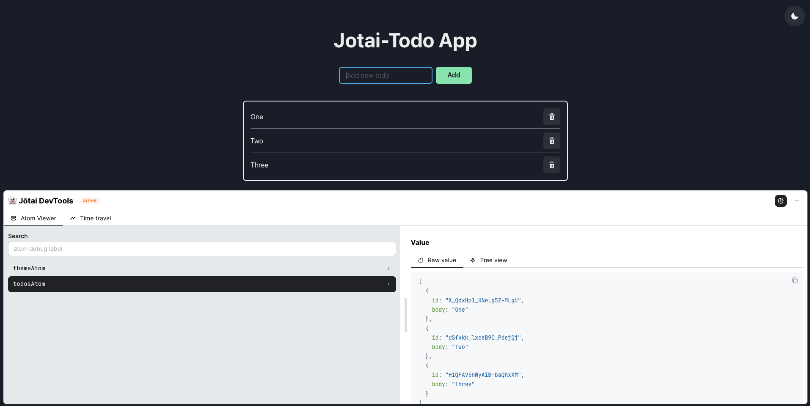

[](https://github.com/kilee1230/jotai-todo/actions/workflows/gh-pages.yml)

# React + TypeScript + Vite + Jotai + Chakra UI

This repository provides a setup to get React working in Vite with Jotai for state management, including devtools for debugging, and Chakra UI for styling. The application includes a todo list and theme update functionality.

## Features

- **React**: A JavaScript library for building user interfaces.
- **TypeScript**: A typed superset of JavaScript that compiles to plain JavaScript.
- **Vite**: A fast build tool for modern web projects.
- **Jotai**: A primitive and flexible state management library for React.
- **Chakra UI**: A simple, modular, and accessible component library for React.
- **Devtools**: Integrated devtools for Jotai to help with debugging state.

## Getting Started

To get started with this project, follow these steps:

1. **Clone the repository**:

   ```sh
    git clone https://github.com/kilee1230/jotai-todo.git
    cd jotai-todo
   ```

2. **Install dependencies**:

   ```sh
   pnpm install
   ```

3. **Run the development server**:
   ```sh
   pnpm dev
   ```

## Expanding the ESLint configuration

If you are developing a production application, we recommend updating the configuration to enable type-aware lint rules:

- Configure the top-level `parserOptions` property like this:

  ```js
  export default tseslint.config({
    languageOptions: {
      // other options...
      parserOptions: {
        project: ["./tsconfig.node.json", "./tsconfig.app.json"],
        tsconfigRootDir: import.meta.dirname,
      },
    },
  });
  ```

- Replace `tseslint.configs.recommended` with `tseslint.configs.recommendedTypeChecked` or `tseslint.configs.strictTypeChecked`
- Optionally add `...tseslint.configs.stylisticTypeChecked`
- Install [eslint-plugin-react](https://github.com/jsx-eslint/eslint-plugin-react) and update the config:

## Usage

### Todo List

The todo list allows you to add, remove, and mark tasks as completed. The state is managed using Jotai, providing a simple and flexible way to handle state changes.

### Theme Update

The application supports theme switching between light and dark modes using Chakra UI. The current theme state is also managed by Jotai.

## Devtools

Jotai devtools are integrated to help you debug the state changes in your application. You can inspect the state and see how it evolves over time.

## Screenshot



## Learn More

To learn more about the tools used in this project, check out the following resources:

- [React](https://reactjs.org/)
- [TypeScript](https://www.typescriptlang.org/)
- [Vite](https://vitejs.dev/)
- [Jotai](https://jotai.org/)
- [Chakra UI](https://chakra-ui.com/)
- [Jotai Devtools](https://github.com/pmndrs/jotai/tree/main/devtools)
